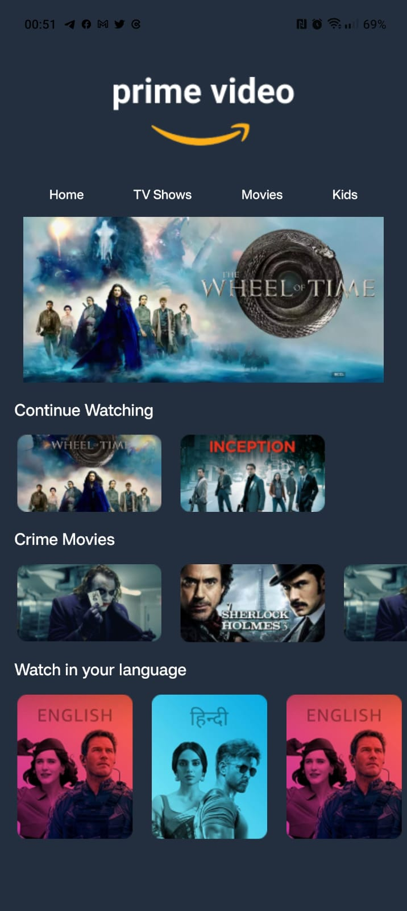

# Clone do Prime Video

Desenvolvendo o front baseado na interface do app **Prime Video** para estudos.

## Referência

- [Jovem Programador](https://youtu.be/aLJvoPqyMA0)

## Instalação

Instale o projeto com yarn

```bash
  yarn install
```

Em seguida:

```bash
  yarn start
```

## Autores

- [Douglas Moraes](https://www.github.com/octokatherine)

## Interface



## 🚀 Estudando

Conhecendo um pouco mais do universo React native com Expo.

## Stack utilizada

**Front-end:** React native, Expo

**Back-end:** -

[](https://choosealicense.com/licenses/mit/)